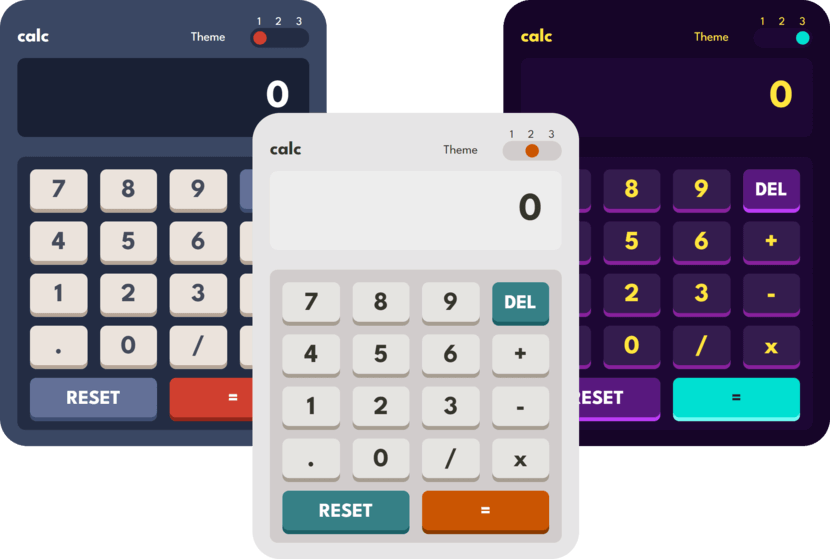

# Calculator app

This is a solution to the [Calculator app challenge on Frontend Mentor](https://www.frontendmentor.io/challenges/calculator-app-9lteq5N29)

## Table of contents

- [Overview](#overview)
  - [The challenge](#the-challenge)
  - [Screenshot](#screenshot)
  - [Links](#links)
- [My process](#my-process)
  - [Built with](#built-with)
  - [What I learned](#what-i-learned)
  - [Useful resources](#useful-resources)
- [Author](#author)

## Overview

### The challenge

Users should be able to:

- See the size of the elements adjust based on their device's screen size
- Perform mathmatical operations like addition, subtraction, multiplication, and division
- Adjust the color theme based on their preference

### Screenshot



### Links

- Solution URL: [GitHub CalcApp ](https://github.com/buschenyy/calculator-app)
- Live Site URL: [Calculator App](https://calculator-app-delta-six.vercel.app/)

## My process

### Built with

- CSS custom properties
- Flexbox
- CSS Grid
- [Vite](https://vitejs.dev/) - a build tool.
- [React](https://reactjs.org/) - JS library
- [Classnames](https://www.npmjs.com/package/classnames) - a simple JavaScript utility for conditionally joining classNames together
### What I learned

Make **captions** for input values.

```html
<input type="range" max="2" min="1" id="switch" list="themes" />
<datalist id="themes">
  <option>1</option>
  <option>2</option>
</datalist>
```

**Set** the shadow **color** change animation, **but disable** the animation to change the shadow **size**.

```css
button {
  transition: box-shadow-color var(--anim), box-shadow-x 0s, box-shadow-y 0s, background var(--anim);
}
```

Custom styling `<input type='range' />`

```css
input[type='range'].range {
  width: 75px;
  appearance: none;
}

.range::-webkit-slider-runnable-track {
  height: 25px;
}

.range::-webkit-slider-thumb {
  width: 17px;
  height: 17px;
  -webkit-appearance: none;
}
```

Number processing

```js
//checks if the number is an integer
Number.isInteger(num)

//returns a positive number if the number is negative
Math.abs(num)

//rounds the number to the nearest integer
Math.round(num)

//returns the number in the scientific record as a string
num.toPrecision(n)

//returns a number with a fixed number of decimal places as string
num.toFixed(n)
```
### Useful resources

- [Styling Cross-Browser Compatible Range Inputs with CSS](https://css-tricks.com/styling-cross-browser-compatible-range-inputs-css/) - Here I learned the style setting for `<input type='range/>`.

## Author

- GitHub - [@buschenyy](https://github.com/buschenyy)
- Frontend Mentor - [@buschenyy](https://www.frontendmentor.io/profile/buschenyy)